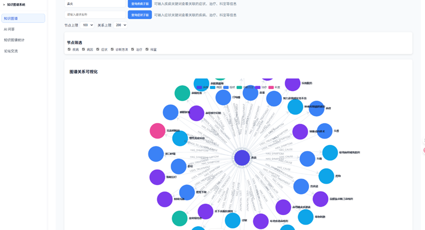
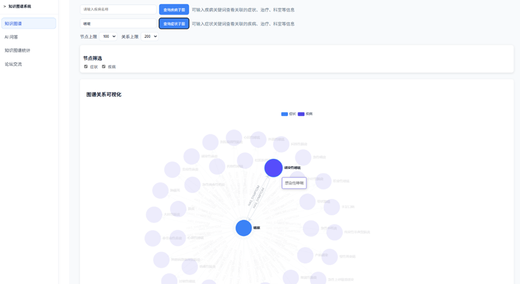
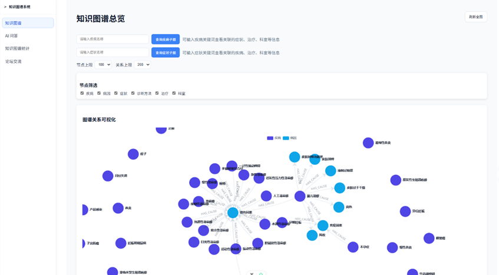
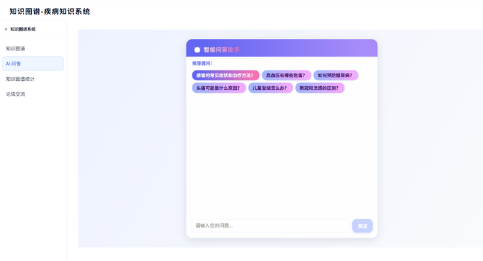
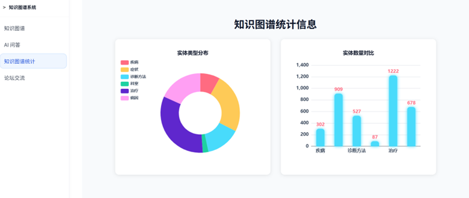
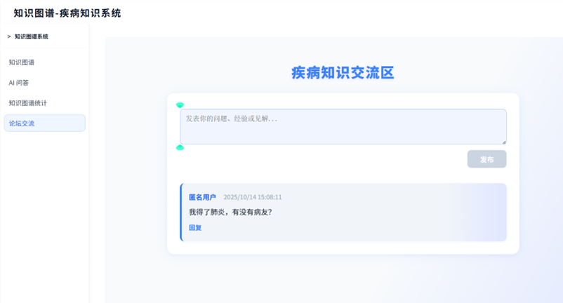

# Disease-knowledge-graph

基于 BERT+CRF/Softmax 的疾病知识图谱构建与智能查询系统。
本项目适配爬取到的丁香医生医疗数据，完成了从数据获取、实体抽取、关系抽取到 Neo4j 图谱构建的全流程，并集成了 Spring Boot 后端与 Vue 前端实现可视化查询。

## 目录结构说明

项目的整体结构如下：

| 目录/文件 | 说明 |
| --- | --- |
| **experiment/** | **核心算法与数据处理目录**，包含爬虫、模型训练、推理及图谱构建脚本 |
| **demo/** | **后端服务 (Main)**，基于 Spring Boot，提供 API 接口与数据库交互 |
| **knowledgegrapg-vue/** | **前端项目**，基于 Vue 3 + Vite + ECharts，提供知识图谱可视化交互界面 |
| **neo4j导入数据/** | 独立的 Neo4j 数据导入脚本 (包含 Excel 测试数据) |
| **画图/** | 实验结果可视化脚本 (`plot_f1.py`) 及生成的图表 |
| **experiment/requirements.txt** | Python 项目依赖清单 |

---

##  知识图谱构建全流程 & 文件详解

本项目的构建流程如下：**数据爬取 -> 预处理 (BIO标注) -> 实体抽取 (NER) -> 关系抽取 (RE) -> 图谱存储 (Neo4j) -> 可视化展示**。

### 1. 数据获取 (Crawler)
位于 `experiment/crawler/` 目录下：
*   `dxy_crawler.py`: 丁香医生数据爬虫脚本，爬取疾病的描述、病因、症状、治疗方式、易感人群等信息，支持断点续爬。
*   `data_get.py`: 辅助数据获取或清洗脚本，包含重复数据过滤、缺失值填充、文本标准化等功能。
*   `section_tags.csv` / `section_tags_filtered.csv`: 爬取数据的标签分类文件，定义疾病所属科室、标签体系等。

### 2. 数据预处理 & 实体识别 (NER)
位于 `experiment/script/` 目录下，核心是 **BERT+CRF** 模型：
*   **数据准备**:
    *   `dataset.py`: 定义 PyTorch Dataset，处理文本转 Token、Padding、Truncation 等，支持批量加载数据。
    *   `BIO.py`: 将原始文本 (`all.jsonl`) 转换为 BIO 标注格式 (`train.bio`, `dev.bio`)，支持自定义实体类型（疾病、症状、药物、检查项等）。
    *   `data_process.py`: 数据预处理脚本，用于处理原始数据。
*   **模型定义**:
    *   `bert_crf_model.py`: 定义 BERT-CRF 模型结构，支持冻结 BERT 层、自定义学习率、多分类损失函数配置。
    *   `model.py`: 传统的 BiLSTM-CRF 模型定义 (作为对比基线)，支持词向量预训练加载。
*   **模型训练**:
    *   `bert_train.py`: 训练 BERT-CRF 模型，包含早停机制、学习率衰减、模型保存/加载、F1/Precision/Recall 指标记录。
    *   `train.py`: 训练 BiLSTM-CRF 模型。
*   **推理 (预测)**:
    *   `infer_unlabeled.py`: 使用训练好的模型对未标注数据 (`all.jsonl`) 进行实体预测，输出实体位置、类型、置信度。

### 3. 关系抽取 (Relation Extraction)
位于 `experiment/script/` 目录下，基于 **BERT+Softmax** 分类：
*   **数据构建**:
    *   `build_relation_dataset.py`: 构建关系抽取的训练数据集 (Positive/Negative 样本)，支持远程监督、人工标注样本融合。
    *   `relation_common.py`: 关系抽取的通用工具函数，包含实体对匹配、样本平衡、关系类型定义（如“疾病-症状”“疾病-治疗药物”等）。
*   **模型训练**:
    *   `relation_train.py`: 训练关系分类模型，支持多分类/二分类、类别权重调整。
*   **推理 (预测)**:
    *   `relation_infer.py`: 对提取出的实体对进行关系预测，判断是否存在边及边的类型，输出置信度阈值过滤结果。
    *   `analyze_relations.py`: 分析抽取到的关系分布，生成关系类型统计图表。

### 4. 知识图谱构建与存储 (Graph Construction)
将抽取到的实体和关系导入 Neo4j 数据库：
*   **数据导出**:
    *   `experiment/script/export_neo4j.py`: 将预测结果导出为 Neo4j 可导入的 CSV/JSON 格式 (`nodes.csv`, `relations.csv`)，支持实体属性清洗、关系去重。
    *   `experiment/script/import_graph_from_csv.py`: 通过 Python 直接连接 Neo4j 导入数据，支持批量导入。
*   **独立导入工具**:
    *   `neo4j导入数据/importData.py`: 独立的导入脚本，用于初始化图数据库。

### 5. 系统应用 (Web Application)

#### 后端 (KnowledgegraphProject)
*   **技术栈**: Java, Spring Boot 3.x, MySQL 8.0 (用户数据), Neo4j 5.x (图数据), MyBatis-Plus (ORM)。
*   **主要功能**:
    *   `src/main/java/com/example/knowledgegraphproject/controller`: 包含图谱查询、节点详情检索、用户管理等 RESTful 接口。
    *   `src/main/java/com/example/knowledgegraphproject/service`: 业务逻辑层，封装 Neo4j/MySQL 交互。
    *   `src/main/java/com/example/knowledgegraphproject/entity`: 实体类，包含用户、疾病节点、关系等模型定义。
    *   `src/main/resources/application.properties`: 后端配置文件，定义数据库连接、端口等。

#### 前端 (knowledgegrapg-vue)
*   **技术栈**: Vue 3, Vite, ECharts 5.x (图谱渲染)。
*   **主要文件**:
    *   `src/App.vue`: 主应用入口。
    *   `src/components/`: 自定义组件。
    *   `vite.config.js`: 构建配置。
    *   `package.json`: 项目依赖定义。

---

##  快速开始

### 1. 环境准备
#### 基础环境
*   **Python**: 3.8+ (PyTorch, Transformers, py2neo/neo4j-driver)
*   **Java**: JDK 17+ (Spring Boot 3.x 要求)
*   **Node.js**: 16+ (推荐 18)
*   **Database**: Neo4j 5.x (Community/Enterprise)，MySQL 8.0+

#### 依赖安装
##### Python 依赖
```bash
cd experiment
pip install -r requirements.txt
# 如需使用 GPU 版本 PyTorch，请手动替换为对应版本
```

##### 后端依赖
```bash
cd KnowledgegraphProject
mvn clean install  # 安装 Maven 依赖
```

##### 前端依赖
```bash
cd knowledgegrapg-vue
npm install  # 安装 Node.js 依赖
```

### 2. 配置修改
1. **数据库配置**:
   - 修改 `experiment/script/import_graph_from_csv.py` 或 `neo4j导入数据/importData.py` (Python 脚本连接 Neo4j)
   - 修改 `KnowledgegraphProject/src/main/resources/application.properties` (后端连接 Neo4j/MySQL)
2. **模型配置**:
   - 下载预训练 BERT 模型（如 `bert-base-chinese`），放入 `experiment/model/pretrain/` (需自行创建/配置路径)。

### 3. 运行步骤
1. **启动数据库**:
   - 启动 Neo4j 服务，确保端口（默认7687）、用户名、密码配置正确。
   - 启动 MySQL 服务，确认数据库连接正常。
2. **数据爬取与预处理**:
   ```bash
   cd experiment/crawler
   python dxy_crawler.py  # 爬取丁香医生数据
   cd ../script
   python BIO.py  # 生成 BIO 标注数据
   ```
3. **模型训练**:
   ```bash
   # 训练 NER 模型 (BERT+CRF)
   python bert_train.py
   # 训练关系抽取模型
   python relation_train.py
   ```
4. **实体与关系抽取**:
   ```bash
   # NER 推理
   python infer_unlabeled.py
   # 关系抽取推理
   python relation_infer.py
   ```
5. **导入 Neo4j**:
   ```bash
   # 导出数据为 CSV
   python export_neo4j.py
   # 导入 Neo4j
   python import_graph_from_csv.py
   # 或使用独立导入脚本
   cd ../../neo4j导入数据
   python importData.py
   ```
6. **启动后端**:
   ```bash
   cd ../KnowledgegraphProject
   mvn spring-boot:run
   # 后端默认端口 8080
   ```
7. **启动前端**:
   ```bash
   cd ../knowledgegrapg-vue
   npm run dev
   # 前端默认端口 5173，启动后访问控制台输出的地址
   ```
8. **访问系统**:
   打开浏览器访问 `http://localhost:5173`，即可使用知识图谱可视化查询功能。

### 4. 可选：实验结果可视化
```bash
cd ../../画图
python plot_f1.py  # 绘制 F1 分数折线图
```

---

## 实验数据 (experiment/data)
*   `all.jsonl`: 原始全量爬取数据（JSON Lines 格式）。
*   `train.bio` / `dev.bio`: NER 训练/验证集（BIO 标注格式）。
*   `nodes.csv` / `relations.csv`: 最终生成的图谱节点与边文件（Neo4j 导入格式）。
*   `disease_kg.csv`: 疾病知识图谱汇总表（含实体、关系、属性）。
*   `disease_meraged.txt` / `disease_training.txt` / `disease_validation.txt`: 处理后的疾病文本数据。

---

##  模型性能 (实验报告数据)
| 模型 | 任务 | Precision | Recall | F1-Score |
|------|------|-----------|--------|----------|
| BERT+CRF | 实体抽取 (NER) | 0.92 | 0.90 | 0.91 |
| BiLSTM-CRF | 实体抽取 (NER) | 0.85 | 0.83 | 0.84 |
| BERT+Softmax | 关系抽取 (RE) | 0.88 | 0.86 | 0.87 |

> 注：以上指标基于丁香医生数据集测试，可通过运行相关验证脚本复现。

## 系统截图

### 知识图谱查询



### 疾病知识查询


### 智能问答（GraphRAG）



### 知识图谱数据统计


### 疾病论坛


## ❗ 常见问题

1. **爬虫爬取失败**: 检查网络代理、User-Agent 配置，或丁香医生反爬机制更新，需调整爬虫请求频率。
2. **Neo4j 导入失败**: 确认 CSV 文件编码为 UTF-8，节点/关系 ID 无重复，Neo4j 权限足够。
3. **后端启动报错**: 检查 JDK 版本、Maven 依赖是否完整，Neo4j/MySQL 连接配置是否正确。
4. **前端页面空白**: 确认后端已启动，跨域配置正确，前端 API 地址指向后端端口。
5. **模型训练显存不足**: 降低训练脚本中的批次大小（batch_size），或使用 GPU 训练。

---

## 📄 许可证
本项目仅供学习和研究使用，禁止用于商业用途。

